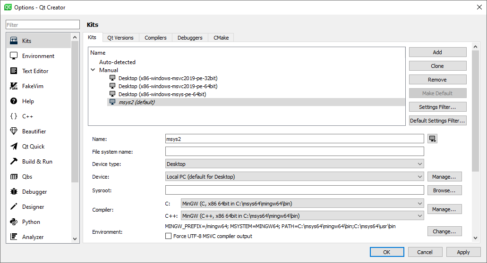

# random-geometric-graph

## Introduction

> In graph theory, a random geometric graph (RGG) is the mathematically simplest spatial network, namely an undirected graph constructed by randomly placing N nodes in some metric space (according to a specified probability distribution) and connecting two nodes by a link if and only if their distance is in a given range, e.g. smaller than a certain neighborhood radius, r.

See more from [https://en.wikipedia.org/wiki/Random_geometric_graph](https://en.wikipedia.org/wiki/Random_geometric_graph).

## Environment

- Windows 10
- MSYS2 64 bit 20200720
- Qt Creator 4.12.4
- _openFrameworks Nightly Build_ (of_v20200818_msys2_mingw64)

Note: The original codes were developed back in 2013 on a Mac with a different version of openFrameworks.
I figure it would be interesting to revisit the repo and migrate it to Windows.
However, as of August 18, 2020, I couldn't make it work with the recent release (0.11.0) of openFrameworks.
See [Compilation failing due to confliting definition in openal](https://forum.openframeworks.cc/t/compilation-failing-due-to-confliting-definition-in-openal/33927).
I ended up with a nightly build that comes with a fix.
Check the following [Setup](#Setup) section for details.

## Setup

- Follow the instructions to install [msys2](https://openframeworks.cc/setup/msys2/) and Qt [Creator](https://openframeworks.cc/setup/qtcreator/).
- Use [Uncrustify](https://sourceforge.net/projects/uncrustify/) to beautify the source codes. Download the latest release and place the executable in the **PATH**. Then follow instructions to [configure Qt Creator](https://doc.qt.io/qtcreator/creator-beautifier.html#:~:text=Select%20Restart%20Now%20to%20restart,select%20in%20the%20Tool%20field.).

- Setup a new kit for msys2. According to this [post](https://forum.openframeworks.cc/t/problem-building-with-qt-creator-msys-64bit-on-windows/34699/4), remember to configure `MINGW_PREFIX` and `MSYSTEM`. (I place msys2 in my _user_ PATH instead of _system_ PATH. Hence, I need to configure the **PATH** again.) See screenshot below.

  

- Download the openFrameworks release and unzip it in a certain **location**. A new openFrameworks project shall be created in **location**'s `apps/myApps`, since the default Makefile would rely on some other files in the related paths.

  

- Finally make sure to choose the custom kit for the Qt project.

  

- If addons are selected in the project creation wizard, remember to create a `addons.make` file and list the chosen addons inside.

## 2D-RGG

## 3D-RGG

TBD
